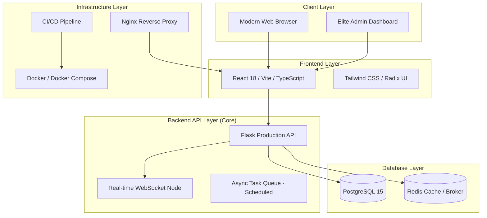

# 🧬 Gene Forge Analyzer

<div align="center">


[](LICENSE)
[](docker-compose.yml)
[](.github/workflows/production-deploy.yml)
[](docs/ARCHITECTURE.md)

**The definitive Open-Source DNA Sequence Analysis & Interpretation Platform**

*A production-grade, full-stack monorepo designed for computational biology, CRISPR research, and molecular diagnostics.*

[Live Demo](https://gene-forge-analyzer.vercel.app) • [Features](#-key-capabilities) • [Quick Start](#-initial-release--v200) • [API](#-api-documentation) • [Security](#-security-practices)

</div>

---

## 📋 Table of Contents

- [Project Overview](#-project-overview)
- [Live Demo](#-live-demo)
- [Tech Stack](#-tech-stack)
- [System Architecture](#-system-architecture)
- [Key Capabilities](#-key-capabilities)
- [Admin Panel Overview](#-admin-panel-overview)
- [Folder Structure](#-folder-structure)
- [Installation (Local)](#-installation-local)
- [Docker Setup](#-docker-setup-instructions)
- [Environment Variables](#-environment-variables-guide)
- [API Documentation](#-api-documentation)
- [Deployment Guide](#-deployment-guide)
- [CI/CD Workflow](#-cicd-workflow)
- [Security Practices](#-security-practices)
- [Roadmap](#-roadmap)
- [Troubleshooting](#-troubleshooting)
- [License](#-license)

---

## 🚀 Project Overview

Gene Forge Analyzer is a startup-grade bioinformatics platform that combines cutting-edge molecular biology tools with modern web technologies. Built for researchers, clinicians, and bioinformaticians, it provides a comprehensive suite of DNA analysis tools powered by elite AI interpretation engines.

The platform focuses on **scientific rigor**, **enterprise security**, and **modular scalability**, making it suitable for both institutional research and production-grade SaaS applications.

### 🔗 Live Demo
Explore the platform live: [Gene Forge Analyzer Production](https://gene-forge-analyzer.vercel.app)

---

## 🏗️ System Architecture

Our architecture follows a modular, decoupled approach designed for high availability and secure data processing.



---

## 🛠 Tech Stack

| Layer | Technology |
|-------|------------|
| **Frontend** | React 18, TypeScript, Vite, Tailwind CSS, Recharts, Radix UI |
| **Backend** | Python 3.11, Flask 3.0, SQLAlchemy, Gunicorn, WebSockets |
| **Database** | PostgreSQL 15, SQLite (Dev), Redis |
| **AI Engine** | OpenAI GPT-4o, Google Gemini 2.0 Flash (Long-Context) |
| **DevOps** | Docker, GitHub Actions, Nginx, Render / Vercel |

---

## ✨ Key Capabilities

### 🔬 Molecular Analysis
- **CRISPR Engineering**: Identify optimized gRNA targets with full PAM site validation.
- **Structural Mapping**: GC Content analysis, Palindrome detection, and Motif identification.
- **Translation Engine**: High-fidelity DNA to Protein sequence translation using standard NCBI codon tables.
- **Restriction Mapping**: Digital restriction enzyme digestion simulation.

### 🤖 AI Intelligence
- **Genomic Interpretation**: Automated AI insights for complex sequence structures.
- **Explainable Results**: Scientific rationale provided for every AI recommendation.
- **Real-time Synthesis**: Streaming AI feedback directly into the Tool Workspace.

---

## 👨‍💼 Admin Panel Overview

Access the high-security admin gateway at `/admin/login`.

- **Operational Dashboard**: Real-time telemetry on system health and node status.
- **Personnel Matrix**: Role-based access control (RBAC) for managing research teams.
- **Neural Core Control**: Manage AI API quotas, rotation keys, and model selection.
- **Forensic Logs**: Immutable audit trails tracking every mutation and access event.
- **Emergency Lockdown**: Instantly suspend all non-administrative traffic in case of a security event.

---

## 📁 Folder Structure

```text
Gene_Forge_Analyzer/
├── .github/workflows/          # CI/CD Automation (GitHub Actions)
├── apps/
│   ├── backend/                # Primary Flask API Node
│   │   ├── app.py              # Production Entry Point
│   │   ├── routes/             # API Router Modules
│   │   └── Dockerfile          # Optimized Python Image
│   ├── frontend/               # React Application
│   │   ├── src/                # Modular Component Architecture
│   │   └── Dockerfile          # Multi-stage Nginx Image
│   └── backend-node/           # Optional Node.js Service Node
├── scripts/                    # DevOps & Maintenance Scripts
├── docker-compose.yml          # Production Orchestration
├── .env.example                # Canonical Environment Template
└── CHANGELOG.md                # Version History & Release Notes
```

---

## 📥 Installation (Local)

### Prerequisites
- **Node.js**: v20.x
- **Python**: 3.11+
- **Docker**: Engine 24+

### Local Setup
1. **Clone Repository**:
   ```bash
   git clone https://github.com/drShankarMote-AI-Dev/Gene_Forge_Analyzer.git
   cd Gene_Forge_Analyzer
   ```
2. **Setup Dependencies**:
   ```bash
   npm run build:all # Bootstraps both frontend and backend
   ```
3. **Configure Environment**:
   ```bash
   cp .env.example .env
   ```
4. **Launch Development Environment**:
   ```bash
   npm run dev
   ```

---

## 🐳 Docker Setup Instructions

The platform is optimized for containerized production environments.

### 🚀 Production Deployment
```bash
# Optimized build for production
docker compose build --no-cache

# Start the cluster in detached mode
docker compose up -d

# Verify system health
docker compose ps
```

### 🛠 Docker Maintenance
```bash
# View aggregated production logs
npm run docker:logs

# Total system reset
npm run docker:clean:all
```

---

## 🔐 Environment Variables Guide

| Variable | Requirement | Description |
|----------|-------------|-------------|
| `DATABASE_URL` | **Required** | PostgreSQL connection string or SQLite path |
| `SECRET_KEY` | **Required** | Cryptographic secret for session signing |
| `JWT_SECRET_KEY` | **Required** | Secret for JSON Web Token generation |
| `ADMIN_EMAIL` | Optional | Default credentials for initial setup |
| `OPENAI_API_KEY` | Optional | Powers GPT-4o Interpretation |
| `GEMINI_API_KEY` | Optional | Powers Gemini 2.0 Sequence Analysis |

---

## 📡 API Documentation

Standardized RESTful endpoints for external integration:

- `POST /auth/login`: Authenticate and receive an encrypted JWT.
- `GET /api/health`: Comprehensive node health report.
- `POST /api/analyze/crispr`: Submit sequence for gRNA target identification.
- `POST /api/ai/interpret`: AI-powered interpretation of genomic findings.
- `GET /api/admin/system-stats`: [SECURE] Administrative telemetry.

---

## 🚢 Deployment Guide

### Cloud Native (Recommended)
- **Frontend**: Deploy to **Vercel** for optimal performance and edge caching.
- **Backend**: Deploy to **Render** using the provided `render.yaml` or to **AWS/GCP** via Docker.
- **Database**: Managed **PostgreSQL** is required for production data persistence.

---

## 🔄 CI/CD Workflow

We utilize **GitHub Actions** for our production pipeline:

1. **Lint & Test**: Every PR triggers automated ESLinting and Unit Testing.
2. **Build Validation**: Frontend and Backend builds are verified for compilation errors.
3. **Docker Stage**: Production images are built and pushed to a registry.
4. **Security Scan**: Dependencies are scanned for vulnerabilities via automated tooling.

See `.github/workflows/production-deploy.yml` for implementation details.

---

## 🛡️ Security Practices

- **Zero-Commit Policy**: Secrets and environment files are NEVER committed to version control.
- **RBAC**: Multi-tiered permission levels for Admin and Standard research roles.
- **Rate Limiting**: Intelligent throttling on all API endpoints to prevent DDoS.
- **Session Security**: HttpOnly, Secure, and SameSite cookie policies enforced by default.
- **Data Encryption**: AES-256 encryption for sensitive genomic sequence metadata.

---

## 🗺 Roadmap

- [ ] **v2.1.0**: Collaborative Research Rooms (Real-time).
- [ ] **v2.2.0**: Integration with NCBI BLAST API.
- [ ] **v2.3.0**: Advanced Phylogenetic Tree Visualization.
- [ ] **v3.0.0**: Hybrid Quantum-Classical Genomic Search Engines.

---

## 🔧 Troubleshooting

- **Database Connection**: Ensure the `db` service is healthy before the `backend` starts.
- **Nginx 404**: Verify that the SPA rewrite rules in `apps/frontend/nginx.conf` are active.
- **Memory Limits**: Production builds require at least 2GB of RAM for the container cluster.

---

## 📄 License

Gene Forge Analyzer is open-source software licensed under the **MIT License**.

---

## 🔢 Project Versioning

We adhere to **Semantic Versioning (SemVer)**:
- **Major (v2.0.0)**: Substantial architectural shifts or breaking API changes.
- **Minor (v2.1.0)**: New features without breaking existing genomic tools.
- **Patch (v2.0.1)**: Refinements, security patches, and structural optimizations.

---

<div align="center">

**Initial Release**: v2.0.0  
**Status**: Stability Certified (Ready for Operations) ✅  
**Maintainer**: Dr. Shankar Mote & The Research Community

[Back to Top](#-gene-forge-analyzer)

</div>
