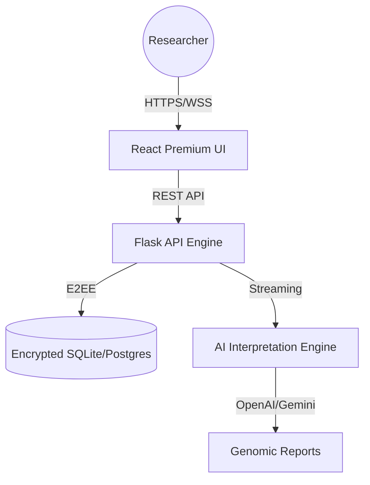

# 🧬 Gene Forge Analyzer

> **The definitive Open-Source DNA Sequence Analysis & Interpretation Platform.**
> A production-grade, full-stack monorepo designed for computational biology, CRISPR research, and molecular diagnostics.

[](https://en.wikipedia.org/wiki/Galois/Counter_Mode)
[](https://flask.palletsprojects.com/)
[](LICENSE)

---

## 🚀 Overview

Gene Forge Analyzer is a professional toolkit for researchers and bioinformaticians. It provides a suite of analytical tools for DNA sequence verification, structural inspection, and molecular precision, powered by a high-performance Flask backend and a premium React frontend.

### ✨ Key Capabilities
- **🔬 CRISPR Detection**: Identification of optimized gRNA targets and PAM site analysis.
- **🧬 Structural Analysis**: GC Content, Reverse Complement, and Reading Frame mapping.
- **🧪 Molecular Translation**: High-fidelity DNA to Protein sequence translation using standard codon tables.
- **🏥 Medical Informatics**: SNP Detection, Restriction Site mapping, and mutation analysis.
- **🤖 Biological Intelligence**: Advanced LLM Interpretation Layer (OpenAI GPT-4o / Gemini 2.0) for automated genomic insights.

---

## 🏗️ Architecture



### Tech Stack
- **Frontend**: React 18, Vite, TypeScript, Tailwind CSS, Lucide Icons, Recharts.
- **Backend**: Python 3.11, Flask, SQLAlchemy, JWT-Extended, Socket.IO.
- **Security**: AES-256-GCM Encryption, BCrypt Hashing, Secure Cookies.
- **AI**: OpenAI GPT-4o / Google Gemini 2.0 Flash Routing.

---

## 🛠️ Local Development

### Prerequisites
- **Node.js**: v20+
- **Python**: 3.11+
- **API Keys**: OpenAI or Google Gemini (optional for AI features)

### Quick Start (The "Turbo" Way)

1. **Install and Setup**:
   ```bash
   npm run install:all
   ```

2. **Configure Environment**:
   ```bash
   cp .env.example .env
   cp apps/backend/.env.example apps/backend/.env
   cp apps/frontend/.env.example apps/frontend/.env
   ```
   *Update the `.env` files with your local database URL and AI API keys.*

3. **Launch Everything**:
   ```bash
   npm run dev
   ```
   *This starts the Flask server and Vite client concurrently with unified logging.*

---

## 🐳 Docker Orchestration

We provide a streamlined Docker experience for both development and production.

### Development (Orchestrated)
```bash
npm run docker:up
```
*Access: Frontend at [localhost:3000](http://localhost:3000), Backend at [localhost:5000](http://localhost:5000)*

### Production (Unified)
The root `Dockerfile` creates a single, optimized image where the Flask server serves the compiled React frontend, ideal for platforms like Render or Railway.

```bash
docker build -t geneforge-prod .
docker run -p 5000:5000 --env-file .env geneforge-prod
```

---

## 🔒 Security & Privacy

Gene Forge Analyzer is built with a **Security-First** mindset:
- **Genomic Privacy**: All DNA sequences are encrypted at rest using user-specific master salts.
- **E2E Encryption**: Real-time collaboration channels are encrypted on the client side.
- **Role-Based Access**: Granular control for Admin vs. Researcher roles.
- **Audit Logging**: Every sensitive action (data export, AI usage) is logged for security review.

---

## 🎨 Professional Aesthetics

This application isn't just functional—it's beautiful.
- **Glassmorphism UI**: A modern, translucent design system.
- **Real-time Visualizations**: Interactive GC-content distribution charts.
- **Micro-interactions**: High-fidelity animations for neural processing states.
- **Responsive Layout**: Designed for both desktop workstations and laboratory tablets.

---

## 🤝 Contributing

Contributions are what make the open-source community an amazing place to learn, inspire, and create.
1. Fork the Project
2. Create your Feature Branch (`git checkout -b feature/AmazingFeature`)
3. Commit your Changes (`git commit -m 'Add some AmazingFeature'`)
4. Push to the Branch (`git push origin feature/AmazingFeature`)
5. Open a Pull Request

---

## 📄 License

Distributed under the MIT License. See `LICENSE` for more information.

**Maintained by drShankarMote-AI-Dev**
